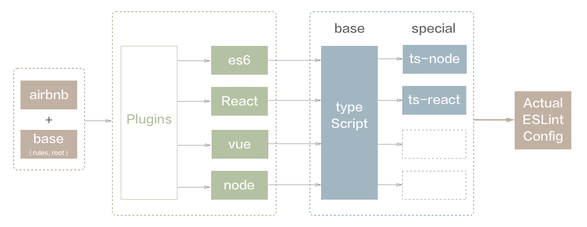

## eslint-config-mfe
[Chinese Version](./README_zh.md)

Sharable ESLint configuration for mfe team, supporting es6、react、react-native、vue、node。All configuration based on airbnb and modified for mfe team requirements.

And TypeScript is supported with followed structure:



What's more, the specific ts eslint rules refers to [eslint-config-alloy](https://github.com/AlloyTeam/eslint-config-alloy/blob/master/typescript.js) directly.

### Installation & Usage

#### install eslint-config-mfe

use npm or yarn：

```
  npm install eslint-config-mfe
```

#### install dependencies

follow deps are required：

* base depends：
  + eslint
  + babel-eslint
  + typescript-eslint-parser
* plugins & config:
  + eslint-config-airbnb-base or eslint-config-airbnb
  + eslint-plugin-import
  + eslint-plugin-vue
  + eslint-plugin-react
  + eslint-plugin-node
  + eslint-plugin-jsx-a11y
  + eslint-plugin-typescript

within them，please install plugins according to the requirements for special project type

#### config .eslintrc.js

create .eslintrc.js file under the root path of your project, then copy follow codes into the file

```
  module.exports = {
    extend: [
      'eslint-config-mfe/eslintrc.react.js',
      // add typescript config for ts support
      // 'eslint-config-mfe/eslintrc.typescript-react.js'
    ]
  };
```

for es6、vue、node project, please modify extend path to corresponding file, such as eslintrc.es6.js

### quickly integration

For quickly integration, CLI tool is supported: [eslint-init](https://www.npmjs.com/package/eslint-init).
