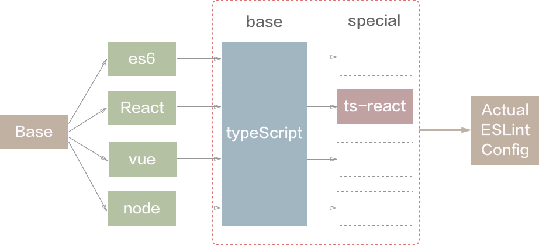

## eslint-config-mfe

MFE团队通用ESLint 规范，包含es6、react、vue、node规范。es6规范基于airbnb-base，react规范基于airbnb，vue规范基于eslint-plugin-vue。

此外，规范提供了 typescript 支持，整体结构设计如下：



### Installation & Usage

#### 安装 eslint-config-mfe

使用 npm 安装：

```
  npm install eslint-config-mfe
```

#### 安装依赖

首先需要安装依赖，包括：

* base depends：
  + eslint
  + eslint-babel
  + typescript-eslint-parser
* plugins & config:
  + eslint-config-airbnb-base or eslint-config-airbnb
  + eslint-plugin-import
  + eslint-plugin-vue
  + eslint-plugin-react
  + eslint-plugin-node
  + eslint-plugin-jsx-a11y
  + eslint-plugin-typescript

其中，plugins请按需安装；

#### 配置 .eslintrc.js

在项目根目录创建.eslintrc.js文件，然后将下面的内容拷入

```
  module.exports = {
    extend: [
      'eslint-config-mfe/eslintrc.react.js',
      // add typescript config for ts support
      // 'eslint-config-mfe/eslintrc.typescript-react.js'
    ]
  };
```

对于 es6、react、vue、node 项目请将文件路径改为对应的文件。

### 快速接入

此外，我们提供了快速接入工具 [eslint-init](https://www.npmjs.com/package/eslint-init)